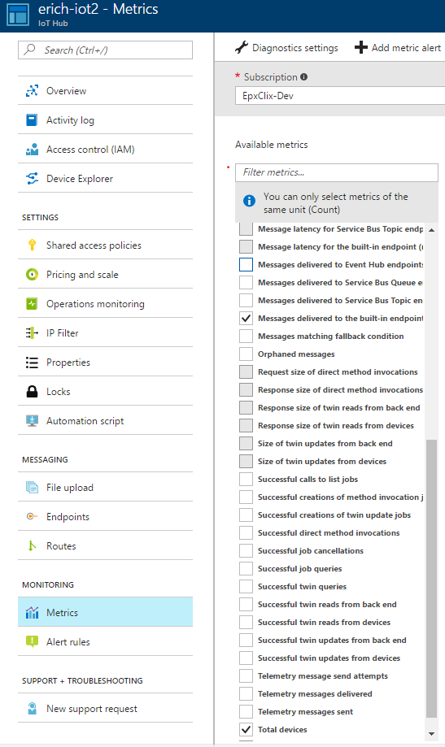
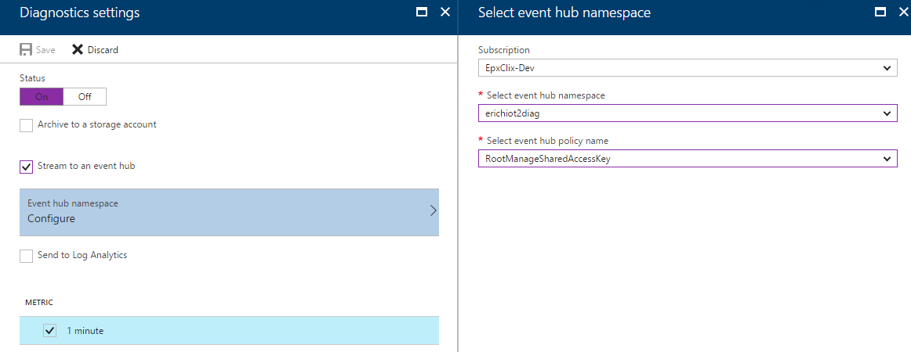
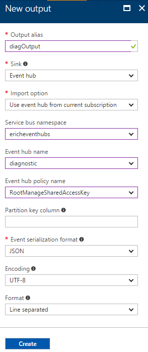

# Enable E2E Diagnostic in a Full-Stack IoT Hub Solution
This tutorial will desmonstrate how to enable end-to-end diagnostic in a full-stack IoT Hub solution.

In this tutorial, you will learn:
* IoT Hub solution architecture
* Setup brand new IoT Hub solution
* Setup IoT Hub solution based on existing IoT Hub and Stream Analytics

## Full-stack IoT Hub solution architecture
FIGURE PALCEHOLDER

## Setup brand new IoT Hub solution

## Setup IoT Hub solution based on existing IoT Hub and Stream Analytics
### Modifying existing IoT Hub
1. Open the existing IoT Hub in Azure portal
2. Click **Metrics** to configure metrics information
3. Check the following metrics from **Available metrics** list, please check the *optional* items if the corresponding endpoints are defined and used:
   * Connected devices
   * Messages delivered to the built-in endpoint (messages/events)
   * Total devices
   * (*optional*) Messages delivered to Event Hub endpoints
   * (*optional*) Messages delivered to Service Bus Queue endpoints
   * (*optional*) Messages delivered to Service Bus Topic endpoints
   
   
   
4. Turn on **Diagnostics settings** for **Metrics** as below, then click OK button first, then Save button.
   
   

### Modifying existing Stream Analytics
1. Open the existing Stream Analytics in Azure portal
2. Click **Overview** tab and click *Stop* button to stop streaming job
3. Click **Outputs** tab under *JOB TOPOLOGY*
4. Click *Add* button to add new output, then click *Create* button

   
5. Click **Query** tab under *JOB TOPOLOGY*, append the following query at the end of existing query, of course you need replace *erichiot2* and *diagOutput* with corresponding input and output in your query:
```sql
SELECT
    *, GetMetadataPropertyValue([erichiot2], '[User].[x-correlation-id]') AS 'x-correlation-id',
    GetMetadataPropertyValue([erichiot2], '[User].[x-before-send-request]') AS 'x-before-send-request'
INTO
    [diagOutput]
FROM
    [erichiot2]
WHERE 
    [x-correlation-id] IS NOT NULL
```
6. Click *Save* button to save the change
7. Switch to **Overview** tab, click *Start* button to start streaming job